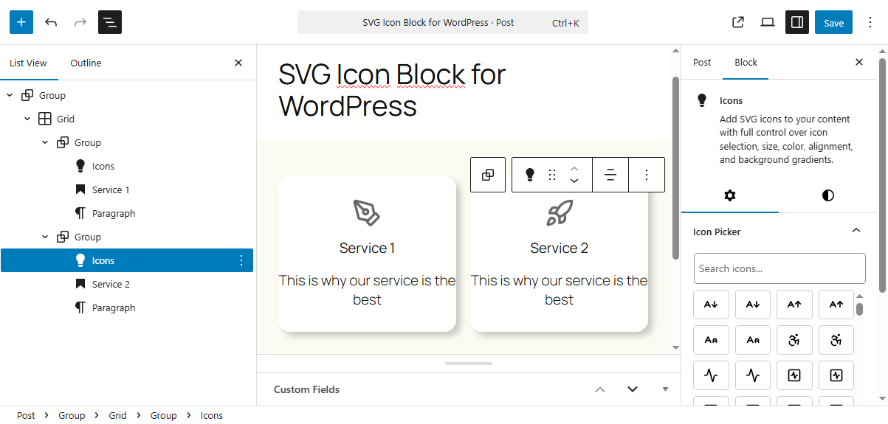
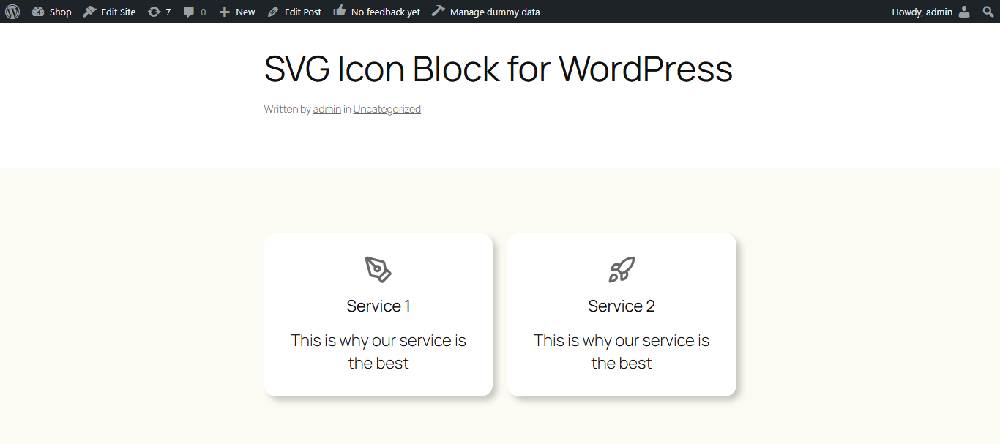

# RIACO Icon Block

RIACO Icon Block to add SVG icons to your content with full control over icon selection, size, color, alignment, and background gradients.

---

## Description

Add customizable icons to your content with full control over icon selection, size, color, alignment, and background gradients. This block allows you to search and choose from a rich library of Lucide icons directly within the WordPress block editor.

---

## Screenshots

### 1. Icon Block in the WordPress Editor

### 2. Icon in the Frontend

---

## Features

- Icon Picker with search functionality
- Adjustable icon size (8px–256px)
- Full color support for icon
- Full color & gradient support for background
- Alignment controls (left, center, right)
- Uses the modern, [Lucide](https://lucide.dev/icons/) icon library
- Fully integrated into the WordPress Styles panel
- Ideal for enhancing visual communication in content, highlighting features, or adding decorative elements

---

## Installation

1. Upload the plugin files to the `/wp-content/plugins/` directory, or install the plugin through the WordPress plugins screen directly.
2. Activate the plugin through the 'Plugins' screen in WordPress.

---

## Frequently Asked Questions

### How do I select an icon?

Open the block settings panel in the right sidebar, and click on the “Icon Picker.” Use the search box to quickly find and select any icon from the Lucide library.

---

## Credits

Icons used are from [Lucide Icons](https://lucide.dev/icons/) and [WordPress Social Icons](https://github.com/WordPress/gutenberg/tree/trunk/packages/block-library/src/social-link/icons)..

---

## Changelog

### 1.0.0

- Add WordPress Social Icons
- Add custom SVG as string
- Convert Lucide Icons as SVG strings to reduce build dimensions
- Use Icon WordPress component to display SVG icons
- Add border and border radius to icon

### 0.1.0

- Initial release

---

## License

This plugin is licensed under the [GPL-2.0-or-later](https://www.gnu.org/licenses/gpl-2.0.html).
